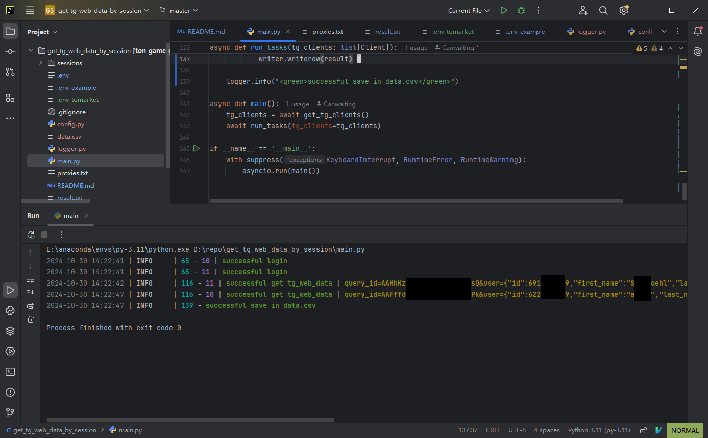
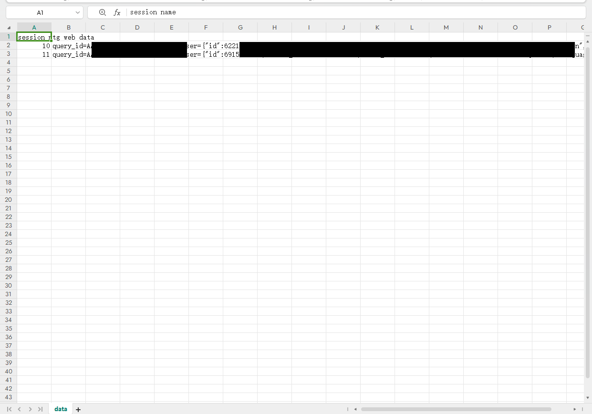

# tg-web-data-extractor

Tired of manually getting tg_web_data for running some script to farm? __Try this script__

## Features

This script supports generating corresponding tg_web_data through sessions, and also supports separate proxy.

Finally, the data will be saved in data.csv

## Python 3.11 (that's the version i am using)

## Usage

1. Place your session files in the `sessions/` directory.
2. Optionally, add proxies to `proxies.txt` (one per line).
3. change the .env like .env-example(you need to find out the PEER and GAME_URL)

## References:

[shamhi](https://github.com/shamhi)'s projects

## TODO:

-[ ] Exception handling ensures that even if data is not successfully obtained, the program can still run normally
-[ ] Switch to selected mode
-[ ] Support multiple retries